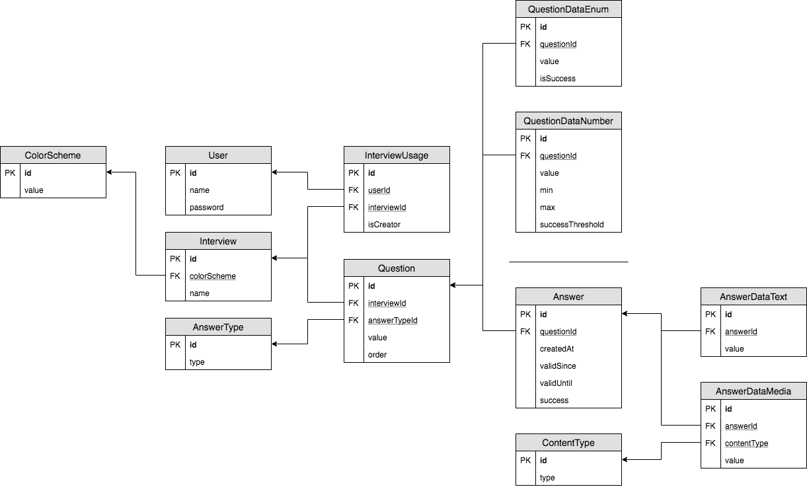

# Interviewer
Interviewer is a REST service which allows users to sign up and register questions which they will be asked on a regular basis. 

For example a user might want to track body height, look of their face, or what feels relevant at a given time. For these cases, questions would be "Your current body height?" (asked once a month), "Photo of your face?" (asked every two weeks), and "What is important to you next week?" (asked every Sunday).

Previous entries can be retrieved and edited retrospectively.

The app is currently being developed.

## Setup
Wit git, [Node.js](https://nodejs.org/) 9, and npm installed, execute the commands
```bash
git clone https://github.com/Simsso/Interviewer`
cd Interviewer
npm install
mv env.sample .env
```
in order to install the service on Linux or Mac. Open the .env file which is located in the project root and adjust all values depending on the environment. Subsequently, start the service with
```bash
npm start
```

## System Architecture
This project contains the Interviewer core API service which is a Node.js application. Furthermore, all database access is included as well as database setup scripts. Both components are highlighted in the figure below.


## Database

